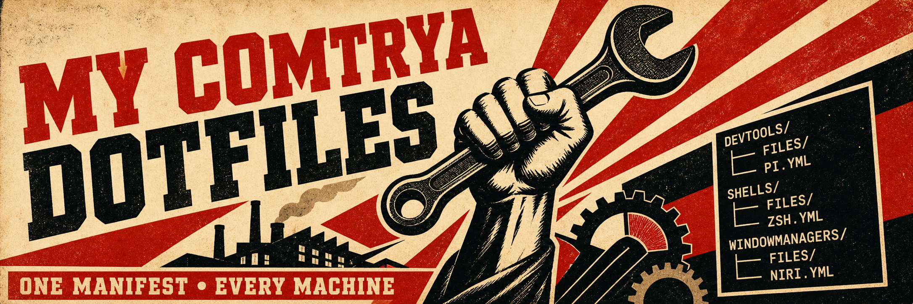

# My DotFiles



- zsh
- powershell

## Install

### Linux and macOS

```bash
curl https://mise.run | sh
mise bootstrap --from-git zenobi-us/dotfiles
```

### Windows

Open PowerShell as administrator.

```powershell
Enable-WindowsOptionalFeature -Online -FeatureName Microsoft-Windows-Subsystem-Linux,VirtualMachinePlatform -All -NoRestart
```

Restart Windows. Then run:

```powershell
winget install -e --id mise.run
mise bootstrap --from-git zenobi-us/dotfiles
```

## Usage

Apply the full machine setup:

```bash
mise bootstrap --yes
```

Apply one bootstrap phase:

```bash
mise bootstrap --only dotfiles --yes
mise bootstrap --only tools --yes
mise bootstrap --only task --yes
```

Check state without changing the machine:

```bash
mise bootstrap status
mise bootstrap status --missing
mise bootstrap --dry-run
```
