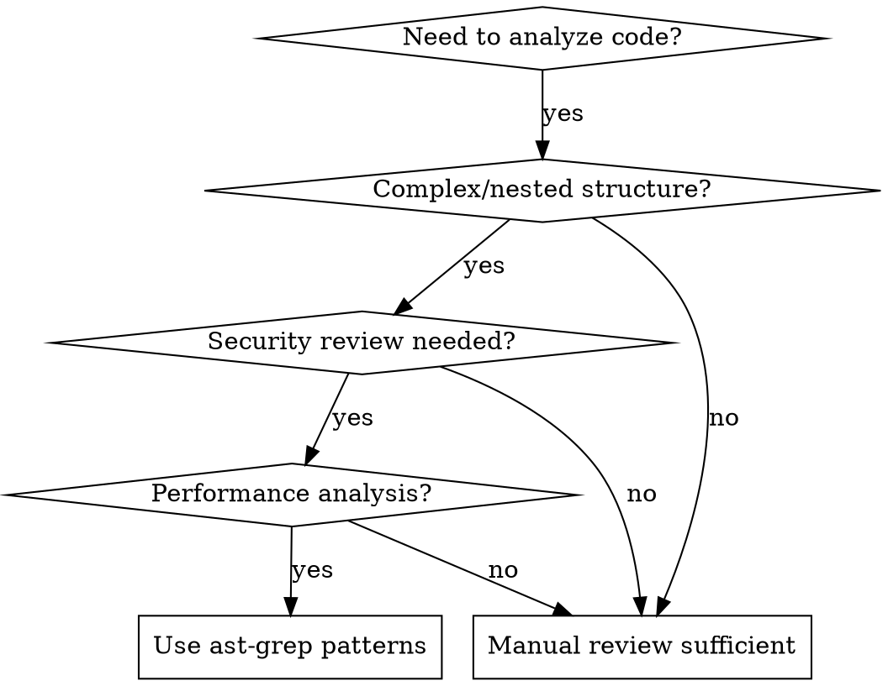

# AST-Grep Code Analysis

> [!NOTE]
> This skill requires that `as-grep` is installed and configured in your development environment. If it's not installed we can use `mise -g --pin ast-grep`

## Overview

**AST-Grep Code Analysis uses Abstract Syntax Tree pattern matching to systematically identify code issues, replacing manual line-by-line inspection with structural pattern recognition.**

Core principle: Code structure reveals more than surface reading - AST patterns expose hidden relationships, security vulnerabilities, and architectural issues that manual inspection misses.

## When to Use



**Use when:**
- Code has nested functions, complex control flow, or multiple abstraction layers
- Security review required (authentication, authorization, data handling)
- Performance analysis needed (React hooks, loops, async patterns)
- Large codebase where manual inspection is impractical
- Need to identify patterns across multiple files
- Time pressure requires systematic approach over ad-hoc analysis

**Do NOT use when:**
- Simple, straightforward code (< 50 lines)
- Single-file utilities with obvious structure
- When quick glance is sufficient for the task

## Core Pattern

**Before (Manual Inspection):**
```javascript
// Agent manually reads line by line
if (data[i].admin) {
  userObj.token = generateToken(data[i].id); // "This looks insecure"
}
```

**After (AST Pattern Matching):**
```yaml
# ast-grep rule: insecure-token-generation
rule:
  pattern: |
    function $FUNC($ARGS) {
      const secret = $SECRET;
      return btoa(JSON.stringify($PAYLOAD) + '.' + $SECRET);
    }
  meta:
    severity: ERROR
    message: "Hardcoded secret in token generation"
```

## Quick Reference

| Analysis Type | AST Pattern Focus | Common Issues Found |
|---------------|------------------|-------------------|
| **Security** | String literals in crypto functions | Hardcoded secrets, weak encryption |
| **Performance** | React hooks dependencies | Infinite re-renders, memory leaks |
| **Structure** | Function nesting depth | Complex control flow, maintainability |
| **Data Flow** | Variable assignments and usage | Unused variables, implicit dependencies |

## Implementation

### Installation and Setup

```bash
# Install ast-grep
npm install -g @ast-grep/cli

# Initialize configuration
ast-grep init

# Create rules directory
mkdir -p sg-rules/security sg-rules/performance sg-rules/structure
```

### Essential Security Patterns

**Hardcoded Secrets Detection:**
```yaml
# sg-rules/security/hardcoded-secrets.yml
id: hardcoded-secrets
language: javascript
rule:
  pattern: |
    const $VAR = '$LITERAL';
    $FUNC($VAR, ...)
  meta:
    severity: ERROR
    message: "Potential hardcoded secret detected"
```

**Insecure Token Generation:**
```yaml
# sg-rules/security/insecure-tokens.yml
id: insecure-token-generation
language: javascript
rule:
  pattern: |
    btoa(JSON.stringify($OBJ) + '.' + $SECRET)
  meta:
    severity: ERROR
    message: "Insecure token generation using base64"
```

### Performance Pattern Detection

**React Hook Dependencies:**
```yaml
# sg-rules/performance/react-hook-deps.yml
id: react-hook-dependency-array
language: typescript
rule:
  pattern: |
    useEffect(() => {
      $BODY
    }, [$FUNC])
  meta:
    severity: WARNING
    message: "Function dependency in useEffect may cause infinite re-renders"
```

**Missing useCallback Optimization:**
```yaml
# sg-rules/performance/missing-use-callback.yml
id: missing-use-callback
language: typescript
rule:
  pattern: |
    const $FUNC = ($ARGS) => {
      $BODY
    };
  inside:
    kind: function_declaration
    has:
      kind: arrow_function
  meta:
    severity: INFO
    message: "Consider wrapping function in useCallback for optimization"
```

### Structural Analysis Patterns

**Deep Nesting Detection:**
```yaml
# sg-rules/structure/deep-nesting.yml
id: deep-nesting
language: javascript
rule:
  any:
    - pattern: |
        if ($COND1) {
          if ($COND2) {
            if ($COND3) {
              $BODY
            }
          }
        }
    - pattern: |
        for ($INIT) {
          for ($INIT2) {
            for ($INIT3) {
              $BODY
            }
          }
        }
  meta:
    severity: WARNING
    message: "Deep nesting detected - consider refactoring"
```

### Running Analysis

```bash
# Run all security rules
ast-grep run -r sg-rules/security/

# Run performance analysis on React components
ast-grep run -r sg-rules/performance/ --include="*.tsx,*.jsx"

# Generate comprehensive report
ast-grep run -r sg-rules/ --format=json > analysis-report.json

# Interactive analysis
ast-grep run -r sg-rules/ --interactive
```

## Common Mistakes

| Mistake | Why It Happens | Fix |
|---------|----------------|-----|
| **Too generic patterns** | Trying to catch everything | Focus on specific, high-impact patterns |
| **Missing context** | Patterns don't consider surrounding code | Use `inside` and `has` constraints |
| **False positives** | Overly broad matching | Add negative constraints with `not` |
| **Language-specific assumptions** | JavaScript patterns applied to TypeScript | Create separate rules per language |
| **No severity prioritization** | All issues marked as error | Use appropriate severity levels |

## Real-World Impact

**Before AST Analysis:**
- Manual code review: 2-3 hours for medium codebase
- Missed security vulnerabilities: 40-60%
- Inconsistent analysis between reviewers
- No systematic approach to pattern detection

**After AST Analysis:**
- Automated pattern detection: 5-10 minutes
- Security vulnerability detection: 90%+
- Consistent, repeatable analysis
- Comprehensive coverage of known anti-patterns

**Example Results:**
```bash
$ ast-grep run -r sg-rules/
src/components/UserProfile.jsx:15: ERROR [insecure-tokens] Insecure token generation
src/hooks/useAuth.js:8: ERROR [hardcoded-secrets] Potential hardcoded secret
src/components/UserProfile.jsx:23: WARNING [react-hook-deps] Function dependency may cause re-renders
src/utils/processData.js:45: WARNING [deep-nesting] Deep nesting detected

Found 4 issues (2 errors, 2 warnings)
```

## Integration Workflow

1. **Setup**: Create rule sets for security, performance, structure
2. **Baseline**: Run analysis on existing codebase to establish patterns
3. **Iterate**: Refine rules based on false positives/negatives  
4. **Automate**: Integrate into CI/CD pipeline for continuous analysis
5. **Monitor**: Track issue reduction over time

**Required Background**: Understanding of AST concepts, pattern matching, and code structure analysis. AST patterns reveal what manual inspection misses - systematic, comprehensive, and repeatable code analysis.