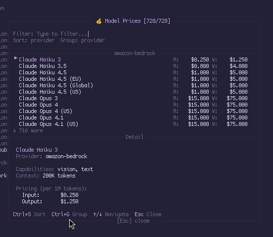

# Model Price Extension



View and compare pricing for all available LLM models in an interactive overlay.

## Usage

### Command

```
/model-price
```

Opens the model price overlay showing all available models with their pricing.

### Keyboard Shortcut

`Ctrl+Shift+P` — Quick access to the overlay

## Controls

| Key | Action |
|-----|--------|
| `↑` / `↓` | Navigate through models |
| `PageUp` / `PageDown` | Jump by page |
| `Ctrl+S` | Cycle sort: name → provider → read cost → write cost |
| `Ctrl+G` | Toggle grouping: by provider ↔ no grouping |
| `Esc` | Clear filter (if active) or close overlay |
| `Ctrl+C` | Close overlay |
| Type | Filter models by name, ID, or provider |

## Features

- **Live Filtering** — Type to instantly filter models by name, ID, or provider
- **Sorting** — Sort by name, provider, input (read) cost, or output (write) cost
- **Grouping** — Group models by provider for easier comparison
- **Detail Panel** — View detailed pricing breakdown for the selected model:
  - Cost per 1M tokens (input, output, cache read/write)
  - Cost per token
  - Context window size
  - Capabilities (reasoning, vision, text)

## Layout

```
╭──────────────── 💰 Model Prices [filtered/total] ───────────────╮
│                                                                  │
│  Filter: [type to filter...]                                     │
│  Sort: provider  Group: provider                                 │
│                                                                  │
├─────────────────────── provider-name ────────────────────────────┤
│ ▸ Model Name                          R: $X.XXX    W: $X.XXX     │
│   Another Model                       R: $X.XXX    W: $X.XXX     │
│                              ↓ N more                            │
├──────────────────────────── Detail ──────────────────────────────┤
│  Model Name                                                      │
│  Provider: provider-name                                         │
│  Capabilities: reasoning, vision, text                           │
│  Context: 200K tokens                                            │
│                                                                  │
│  Pricing (per 1M tokens):                                        │
│    Input:       $X.XXX                                           │
│    Output:      $X.XXX                                           │
│                                                                  │
│  Per token:                                                      │
│    Input:       $0.0000XXXX                                      │
│    Output:      $0.0000XXXX                                      │
│                                                                  │
│ Ctrl+S Sort  Ctrl+G Group  ↑/↓ Navigate  Esc Close               │
╰───────────────────────── [Esc] close ────────────────────────────╯
```

## Price Display

- **R:** Read/Input cost per 1M tokens
- **W:** Write/Output cost per 1M tokens
- **FREE** — Displayed for models with zero cost (e.g., local models)

## License

MIT
