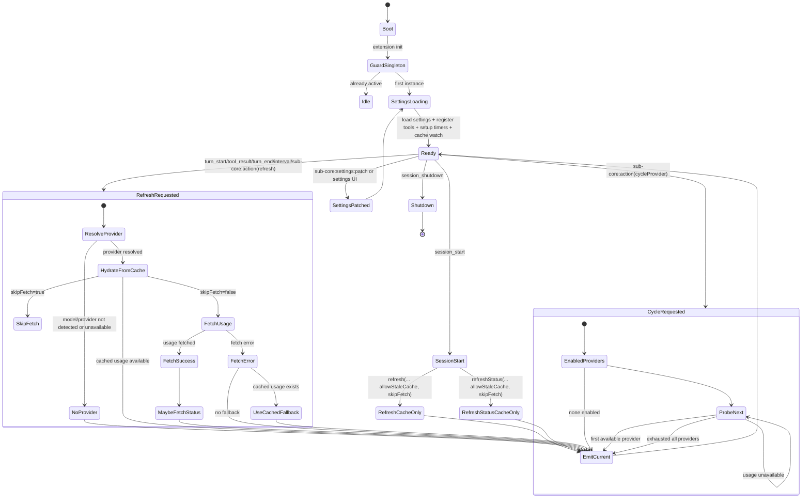

# sub-core usage controller/state machine

Derived from:
- `packages/sub-core/index.ts`
- `packages/sub-core/src/usage/controller.ts`
- `packages/sub-core/src/usage/fetch.ts`
- provider registry + provider impls

## Provider set

`anthropic`, `antigravity`, `codex`, `copilot`, `gemini`, `kiro`, `zai`
