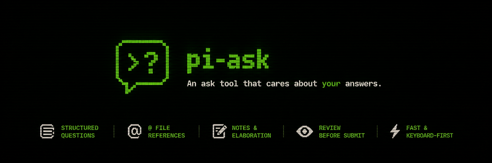
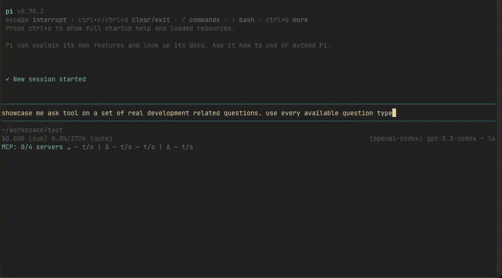
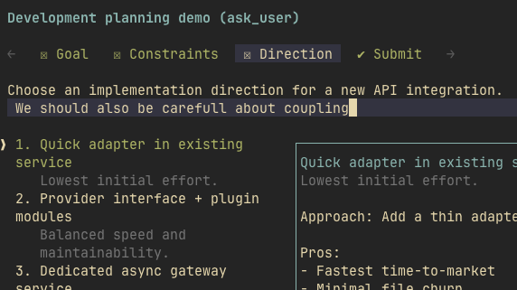
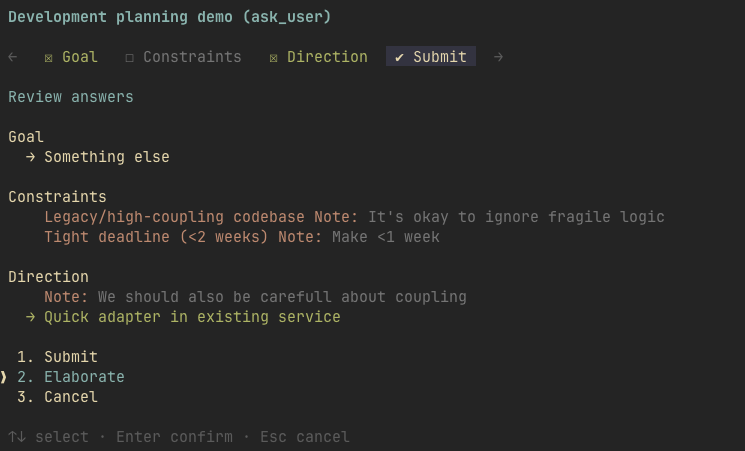
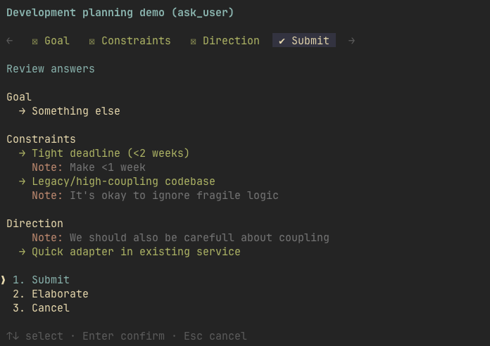
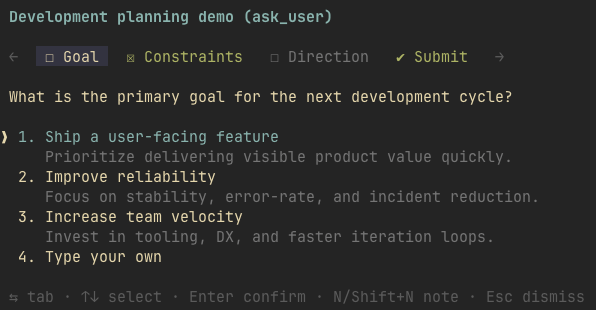

# @eko24ive/pi-ask

[](https://www.npmjs.com/package/@eko24ive/pi-ask)
[](https://github.com/eko24ive/pi-ask/commits/main)
[](https://github.com/eko24ive/pi-ask/stargazers)

`@eko24ive/pi-ask` is an ask tool that cares about your answers.

It lets an agent pause, ask structured questions in a terminal UI, and continue with normalized answers instead of guessing.



High-quality video: [demo.mp4](https://github.com/user-attachments/assets/a8503ca9-afcb-4c31-9edc-353b985a0209)

## Install

```bash
pi install npm:@eko24ive/pi-ask
```

You can also install from git:

```bash
pi install git:github.com/eko24ive/pi-ask
```

Or try it without installing (load once for the current run):

```bash
pi -e npm:@eko24ive/pi-ask
```

## Features

Once installed, this package gives the agent a native way to ask for clarification instead of guessing.

- 🧭 Familiar ask-style interface: tabbed questions, single/multi select, and preview mode
- ✍️ Inline free-form `Type your own` answers
- 📎 Native pi-style `@` file references inside answer and note editors
- 📝 Question-level and option-level notes
- 👀 Review tab with `Submit`, `Elaborate`, and `Cancel`
- 💬 Elaboration flow to capture note-based clarification before final submission
- ⌨️ Context-aware customizable keymaps with aliases for main flow, editors, and settings
- ⚙️ Ask settings with persisted behaviour, notifications, keymaps, and `/answer` extraction config
- 🔔 Optional external notifications when an ask flow is waiting for input
- 🔁 Slash commands for fallback/replay:
  - `/answer` extracts questions from the latest assistant message into an ask flow
  - `/answer:again` reopens the latest `/answer` form on the current branch
  - `/ask:replay` replays the latest real `ask_user` form on the current branch
- 🗣️ You can talk to your agent to configure pi-ask; it will read the bundled configuration guide and tailor the config for you

## Feature walkthrough

### Native `@` file references
Use pi-style `@` file path autocomplete inside free-form answers and note editors.


### Option and question notes
Attach clarification notes to a specific option (`n`) or add broader question-level context (`Shift+N`).

| Option notes | Question notes |
|---|---|
|  |  |

### Review tab — Elaborate and Submit
Ask the agent to elaborate on notes before finalizing choices, or review all answers before returning them to the agent.

| Elaborate | Submit |
|---|---|
|  |  |

### Single-select and multi-select questions
Pick one option when answers are mutually exclusive, or choose multiple options when several answers apply.

| Single-select | Multi-select |
|---|---|
|  |  |

### Preview mode
Use a dedicated preview pane when options need richer detail.


### Custom answer (`Type your own`)
Capture free-form input inline without leaving the flow.


## Default key bindings

Open ask settings with `?` during the ask flow, or with the `/ask-settings` command from pi.

Keymaps are context-aware and configurable in `~/.pi/agent/extensions/eko24ive-pi-ask.json`.
Each action accepts a key string or an array of aliases.

Default contexts:

- `global`: `dismiss` (`Ctrl+C`) and `settings` (`?`)
- `main`: confirm/cancel/toggle, tab navigation, option navigation, and note shortcuts
- `editor`: custom answer submit/close and empty-editor navigation
- `noteEditor`: note save/close and empty-editor navigation
- `settingsModal`: close, next/previous setting, and toggle

Fixed bindings:

| Key | Context | Effect |
|---|---|---|
| `1..9` | Options list | Select or toggle matching option |
| `1` `2` `3` | Review tab | Trigger `Submit` / `Elaborate` / `Cancel` |
| `@` | Editors | File-reference affordance |
| Arrow keys / `Tab` | Non-empty editor | Stay in editor for cursor movement |

Review-tab shortcuts can optionally require the same number key twice via `behaviour.doublePressReviewShortcuts`. `behaviour.presentSingleAsMulti` can render future single-select questions as multi-select while preserving the requested type in results; use `main.changeQuestionType` (`t` by default) to change the active question type live.

You can edit the config file yourself, ask pi to edit it for you, or use `/ask-settings` to find the exact config path, toggle behaviour/notification settings, or reset config to defaults with a guarded double press. pi-ask treats the config file as user-owned: load-time migrations and invalid files are handled in memory without rewriting or backing up the file, and read-only/externally managed configs fail gracefully with a manual-edit message.

```json
{
  "schemaVersion": 5,
  "answer": {
    "extractionModels": [
      { "provider": "openai-codex", "id": "gpt-5.4-mini" },
      { "provider": "github-copilot", "id": "gpt-5.4-mini" },
      { "provider": "anthropic", "id": "claude-haiku-4-5" }
    ],
    "extractionTimeoutMs": 30000,
    "extractionRetries": 1
  },
  "behaviour": {
    "autoSubmitWhenAnsweredWithoutNotes": false,
    "confirmDismissWhenDirty": true,
    "doublePressReviewShortcuts": true,
    "presentSingleAsMulti": false,
    "showFooterHints": true
  },
  "keymaps": {
    "global": { "dismiss": ["ctrl+c"], "settings": ["?"] },
    "main": {
      "confirm": ["enter"],
      "cancel": ["esc"],
      "toggle": ["space"],
      "changeQuestionType": ["t"],
      "nextTab": ["tab", "right"],
      "previousTab": ["shift+tab", "left"],
      "nextOption": ["down"],
      "previousOption": ["up"],
      "optionNote": ["n"],
      "questionNote": ["shift+n"]
    },
    "editor": {
      "submit": ["enter"],
      "close": ["esc"],
      "nextTabWhenEmpty": ["tab", "right"],
      "previousTabWhenEmpty": ["shift+tab", "left"],
      "nextOptionWhenEmpty": ["down"],
      "previousOptionWhenEmpty": ["up"]
    },
    "noteEditor": {
      "save": ["enter"],
      "close": ["esc"],
      "nextTabWhenEmpty": ["tab", "right"],
      "previousTabWhenEmpty": ["shift+tab", "left"],
      "nextOptionWhenEmpty": ["down"],
      "previousOptionWhenEmpty": ["up"]
    },
    "settingsModal": {
      "close": ["esc", "ctrl+c", "?"],
      "nextOption": ["down"],
      "previousOption": ["up"],
      "toggle": ["enter", "space"]
    }
  },
  "notifications": {
    "enabled": true,
    "channels": ["bell"]
  }
}
```

Accepted notation follows pi-tui key ids. Common aliases are normalized, for example `escape` → `esc`, `return` → `enter`, `control+c` → `ctrl+c`, and `Shift+N` → `shift+n`.

## Use

After installation, the extension registers the `ask_user` tool plus `/ask-settings`, `/answer`, `/answer:again`, and `/ask:replay` commands.

Agents can auto-discover and call `ask_user` when they need clarification instead of guessing. In interactive sessions, it opens a terminal UI flow for structured answers, supports native pi-style `@` file references while typing answers or notes, and returns normalized answers back to the agent. Ask settings are available both from `?` in the ask flow and from the `/ask-settings` command. Behaviour and notification settings are binary `on`/`off` toggles that save immediately when the config file is writable; save failures revert the toggle and show a manual-edit message. The settings overlay includes a guarded double-press reset-to-defaults action; keymaps, notification channels, and extraction settings are changed by editing the shown config file path.

### Answer and replay commands

`/answer` is useful when the agent asked questions in plain text instead of using `ask_user`. It extracts questions from the latest completed assistant message and opens the same ask UI.

Replay commands are branch-aware. They read persisted entries from the current pi session branch, so they work naturally with `/resume`, `/tree`, and conversation branching:

- `/answer:again` reopens the latest form created by `/answer` on this branch
- `/ask:replay` reopens the latest real `ask_user` form on this branch

Cancellation is local to the UI: closing a replayed form does not start a new agent turn. Submitted answers are sent back as a normal user follow-up message.

Kudos to [@k0valik](https://github.com/k0valik) for the `/answer` idea.

You can also talk to pi to configure this extension. When asked to customize pi-ask settings, keymaps, notifications, or extraction behavior, the agent is instructed to read the bundled `docs/configuration.md` guide first and then edit the config file accordingly.

This package also bundles the `ask-user` skill profile from `skills/ask-user/SKILL.md`. It reinforces when to use the tool, is enabled by default when installed, and can be disabled via `pi config`. The skill was inspired by https://github.com/edlsh/pi-ask-user.

You can still add your own agent instruction if you want to further reinforce usage.

For exact input/output and UX guarantees, see [`docs/contract.md`](docs/contract.md).

## Local development

### Run locally in pi

```bash
pi -e ./src/index.ts
```

### Run in isolated test mode (extension + bundled skill only)

```bash
pnpm dev
pnpm dev ../test
```

`pnpm dev [path]` runs pi with `--no-extensions --no-skills --no-prompt-templates --no-themes --no-context-files`, loads this repo’s extension and `skills/ask-user`, and starts pi from `[path]` by changing directories before launch (defaults to `.`).

### Install dependencies

```bash
pnpm install
```

### Install git hooks (contributors)

`lefthook` is not installed automatically. If you want the local commit hooks used by this repo, run:

```bash
pnpm exec lefthook install
```

### Development commands

```bash
pnpm format
pnpm lint
pnpm check
pnpm typecheck
pnpm test
```

### Commit workflow

This repo uses `lefthook`, Commitizen, conventional commitlint, and semantic-release.

If you want local hooks, install them once after `pnpm install`:

```bash
pnpm exec lefthook install
```

Recommended flow:

```bash
pnpm commit
```

## Project layout

- `src/` — TypeScript extension implementation
- `tests/` — behavior-focused tests
- `docs/` — small docs set for contract and architecture
- `docs/media/` — repository-only README media assets

## Documentation

Docs stay intentionally small:

- `docs/README.md` — index
- `docs/contract.md` — external behavior
- `docs/architecture.md` — module boundaries and invariants
