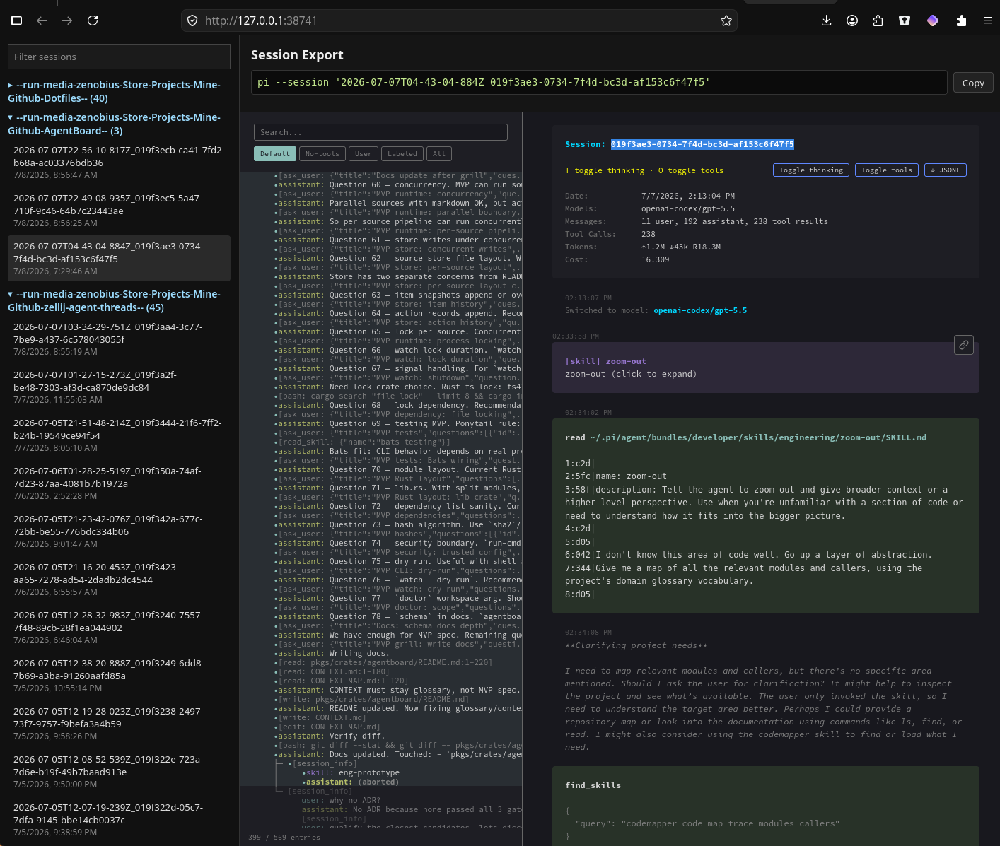

# Session Browser

Browse saved Pi sessions from a local web UI and open any session as a Pi HTML export.



## Load

Pi auto-discovers this extension as a directory extension:

```text
devtools/files/pi/agent/extensions/session-browser/index.ts
```

Install/sync it into `~/.pi/agent/extensions/session-browser/` or point Pi at the directory with your normal dotfiles flow.

## Commands

```text
/session-browser       Start the local browser and open it in your OS browser.
/session-browser-stop  Stop the local browser server.
```

## What it does

- Reads JSONL sessions from `~/.pi/agent/sessions`.
- Starts a local server on `127.0.0.1:38741` or a random free port if that one is busy.
- Shows sessions grouped by workspace path.
- Exports the selected session with `pi --export` into `/tmp/pi-session-browser/public/selected.html`.
- Shows a copyable resume command: `pi --session '<session-id>'`.

## Web UI

The React/Vite UI lives in `./web` and is served by the extension. Runtime dependencies must be available to Pi: `vite`, `react`, `react-dom`, and optionally `@vitejs/plugin-react` for Fast Refresh.
