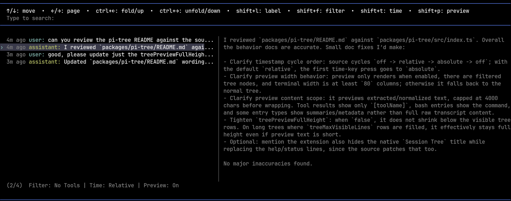

# Pi Tree

[](https://www.npmjs.com/package/@zigai/pi-tree)
[](https://www.npmjs.com/package/@zigai/pi-tree)
[](../../LICENSE)

This Pi extension improves `/tree` with timestamps on every entry, a cleaner help/status line, and an optional right-side preview.

The preview helps when scanning a long session because you can inspect message content without opening each branch.

## Install

```sh
pi install npm:@zigai/pi-tree
```

## Features

- Shows per-entry timestamps in `/tree`.
- Supports `off`, `relative`, and `absolute` timestamp modes.
- Uses Pi's configured tree label-timestamp keybinding, commonly `Shift+T`, to cycle timestamp modes.
- Adds an optional selected-entry preview pane on the right side of `/tree` when the terminal is wide enough.
- Toggles the preview pane with `Shift+P`.
- Reads timestamp and preview choices from global or trusted project Pi settings.
- Can make `/tree` taller with `treeMaxVisibleLines`.
- Can keep the preview pane at full height or shrink it to fit preview content.



## Configuration

Configuration is stored in Pi settings: globally in `~/.pi/agent/settings.json`, or per trusted project in `.pi/settings.json`.

```json
{
  "treeTimestampMode": "relative",
  "treeSelectedPreview": false,
  "treeMaxVisibleLines": 24,
  "treePreviewFullHeight": true
}
```

Settings:

- `treeTimestampMode`: one of `off`, `relative`, or `absolute`. Defaults to `relative`.
- `treeSelectedPreview`: set to `true` to open `/tree` with the preview pane enabled. Defaults to `false`.
- `treeMaxVisibleLines`: optional maximum number of tree rows to show. When unset, Pi's native height is used. Values are clamped to at least `5`.
- `treePreviewFullHeight`: set to `false` if the preview pane may shrink to the selected preview content, but never below the visible tree rows. Defaults to `true`.

You can also change the first two settings from inside `/tree`: use Pi's configured tree time keybinding, commonly `Shift+T`, to cycle timestamp modes, and `Shift+P` to toggle the preview pane. Interactive changes are written to global settings.

## Development

```sh
npm install
npm run check
```

## License

MIT
