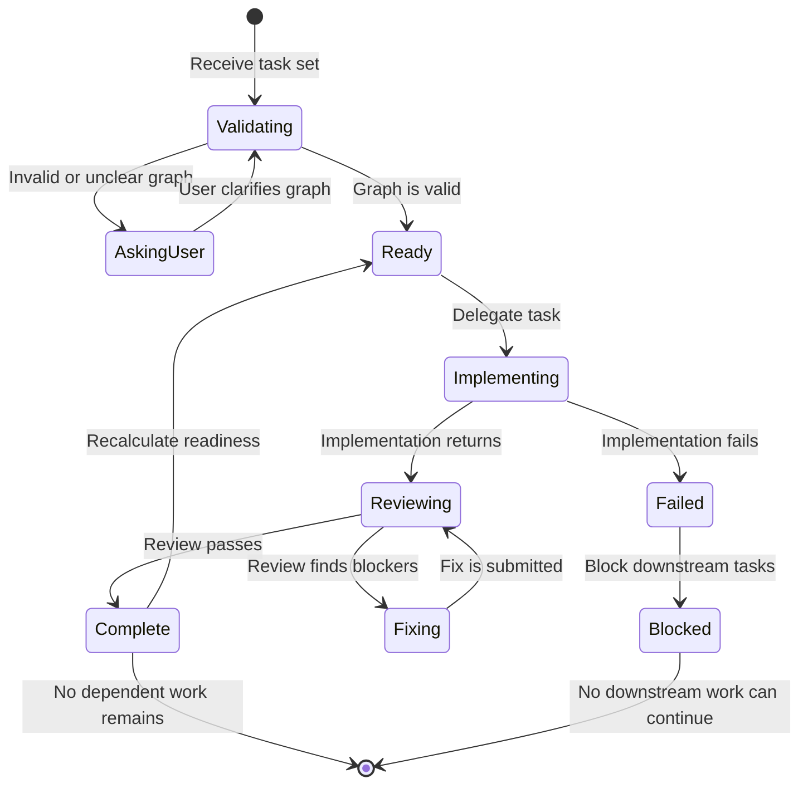

# Task Orchestrator

Use this workflow after the user has established a task set. Do not invent product scope.

This skill coordinates other skills. It does not replace them.

## State machine



## Rule 0: establish the graph model

Before scheduling or delegating any task, create and validate the task-set graph model.

The graph model MUST include:

- One record for every task.
- A stable task ID.
- The task type.
- The task scope.
- Acceptance conditions.
- Dependency IDs.
- Review requirements.
- A current task state.

Store the graph in the run directory:

```text
/tmp/task-orchestrator/<run-id>/
  graph.md
  state.json
```

Do not delegate work until:

1. Every task has a unique ID.
2. Every dependency refers to an existing task.
3. No task depends on itself.
4. The graph has no cycle.
5. Every task has an acceptance condition.
6. Every task has an initial state.
7. The graph and state file agree.

If the graph model is missing or invalid, ask the user or repair it before scheduling work.

## Core rules

- Treat the task list as a directed acyclic graph.
- Treat an edge `A -> B` as `B` blocked by `A`.
- Run independent ready tasks in parallel.
- Run dependent tasks only after all direct dependencies complete.
- Give every delegated task its own handoff file.
- Give every coding task its own Worktrunk worktree.
- Give every implementation a separate review delegation.
- Keep implementation and review work separate.
- Record task state outside the conversation.
- Stop downstream work when an upstream task fails.
- Complete a coding task only after its review passes.
- Ask the user when the graph contains a cycle, missing task, or unclear dependency.

## Workflow

1. Read [task input](reference/task-input.md) and confirm that the workflow may start.
2. Establish and validate the graph model with [graph model](reference/graph-model.md). No scheduling or delegation may start before this step passes.
3. Schedule ready tasks with [scheduling](reference/scheduling.md).
4. Create the required files with [handoffs](reference/handoffs.md).
5. Delegate implementation with [implementation](reference/implementation.md).
6. Run review and fix cycles with [review cleanup](reference/review-cleanup.md).
7. Publish required decisions with [shared context](reference/shared-context.md).
8. Route status and process questions with [query router](reference/query-router.md).
9. Produce the final result with [completion](reference/completion.md).

## Reuse existing skills

Instruct delegated agents to use existing skills. Do not copy their procedures into this skill.

Use the narrowest route that fits the task:

| Need | Instruct the agent to use |
|---|---|
| Start an issue in an isolated worktree | `developer:worktree start <issue>` |
| Operate a Worktrunk worktree | `developer:worktrunk` |
| Open a pane or workspace | `developer:hrdx-subagents` |
| Implement a coding task | `matt-pocock:implement` |
| Implement test-first | `matt-pocock:tdd` |
| Review a completed change | `matt-pocock:code-review` |
| Save durable shared context | `agent-core:shared-context` |
| Follow tracker-based orchestration | `vanilla-green:orch` |
| Follow the implementation workflow | `vanilla-green:dev` |
| Produce a structured review artifact | `vanilla-green:reviewer` |

Do not invoke a skill only to restate its documentation. Invoke it when the delegated task needs its behavior.

## Completion condition

The workflow is complete only when every task is `complete`, `failed`, or `blocked`, and every completed coding task has a passing review.
