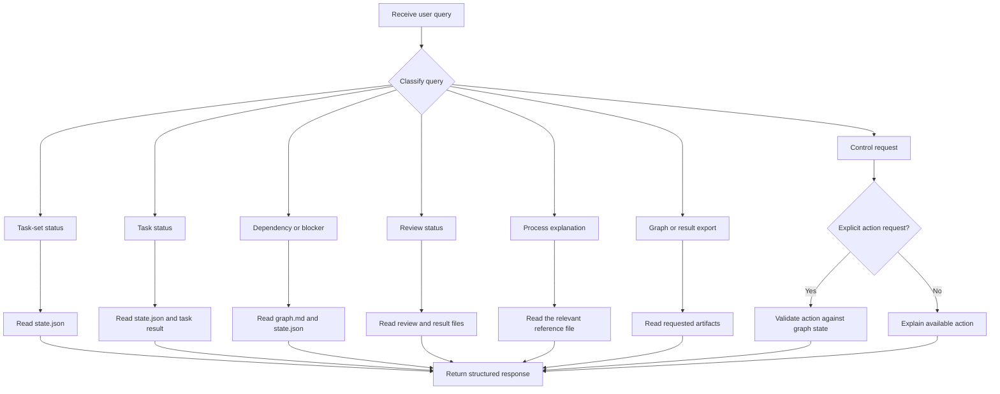

# Query router

Use this reference when the user asks about task-set status, a task, dependencies, reviews, results, or the orchestration process.

## Router rules

1. Read `state.json` before answering a status query.
2. Read `graph.md` before answering a dependency query.
3. Read the relevant result and review files before reporting implementation or review details.
4. Treat persisted files as authoritative over conversation history.
5. Do not change task state for an informational query.
6. Do not restart, retry, stop, resume, mark complete, or delegate work unless the user explicitly requests that action.
7. If the query names an unknown task ID, list valid task IDs and ask the user to choose one.
8. If the run ID is unclear, list available runs and ask the user to select one.
9. Report missing evidence as `not recorded`. Do not infer it.
10. Use the narrowest response that answers the query.

## Query categories

| Query type | Example | Response |
|---|---|---|
| Task-set status | `What is the status?` | Summarise all tasks, states, active work, blockers, and the next wave. |
| Task status | `What is happening with T3?` | Report the task state, dependencies, worktree, implementation, review, validation, and blockers. |
| Dependency status | `Why is T5 blocked?` | Trace incomplete or failed dependencies and show the blocking path. |
| Review status | `Has this passed review?` | Report the review state, verdict, findings, fix attempts, and evidence. |
| Process question | `How does cleanup work?` | Explain the relevant rule and name the reference file. |
| Graph question | `What depends on T1?` | Show direct dependents and downstream tasks. |
| Readiness question | `What can run next?` | Read `state.json` and list ready tasks and unmet conditions. |
| Result question | `What changed?` | Report changed files, commits, validation, and review artifacts. |
| Validation question | `Did the tests pass?` | Report recorded validation commands and results. Do not infer success. |
| Open-items question | `What is unresolved?` | List failed tasks, blocked tasks, non-blocking findings, and follow-up items. |
| Control request | `Stop the run.` | Confirm and record the stop action before changing state. |
| Retry request | `Retry T2.` | Check the failure and dependencies before restarting the task. |
| Resume request | `Continue.` | Read persisted state and schedule the next valid wave. |
| Export request | `Give me the task graph.` | Return the graph or a rendered summary without changing state. |

## Response formats

### Task-set status

```text
## Task-set status

Run: <run-id>
State: running | complete | failed | blocked | stopped

### Tasks

- <task-id>: <state>
  - dependencies: <ids>
  - worktree: <path or none>
  - implementation: <commit or result>
  - review: <state or result>

### Current wave

- <ready or active tasks>

### Blockers

- <blocker or none>

### Next action

- <next scheduled action or none>
```

### Individual task status

```text
## Task <task-id>

State: <state>
Title: <title>
Type: <type>
Dependencies: <ids>
Blocked by: <ids or none>
Worktree: <path or none>
Implementation: <commit or result>
Review: <state, verdict, or artifact>
Validation: <result or not recorded>
Open items: <items or none>
```

### Process explanation

For a process question:

1. Identify the relevant reference file.
2. Explain the rule in short terms.
3. State whether the rule affects the current run.
4. Do not change `state.json`.

Example:

```text
The task is blocked because T5 depends on T3 and T4.
T3 is still reviewing, so T5 cannot start.
This follows the scheduling rule in `reference/scheduling.md`.
No task state was changed.
```

## Query routing flow



## Read and control operations

Read operations do not change state:

- Status.
- Task details.
- Dependency explanations.
- Review explanations.
- Process questions.
- Graph exports.
- Result summaries.

Control operations may change state or start work:

- Start.
- Delegate.
- Retry.
- Stop.
- Resume.
- Mark complete.
- Mark blocked.
- Reopen a task.

Require an explicit user request before running a control operation.
