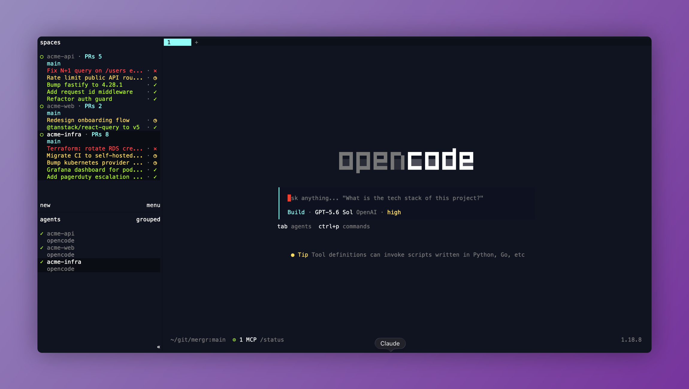

# mergr

`mergr` adds GitHub pull request status to Herdr's Space sidebar. It refreshes
through one background service, reports status through Herdr metadata tokens,
and does not open panes or change focus.



## Requirements

- Herdr 0.7.5 or newer
- macOS on Apple silicon or Intel for prebuilt installation
- Git
- [GitHub CLI](https://cli.github.com/) authenticated with `gh auth login`

The Space must use a local checkout of a GitHub repository that the
authenticated GitHub account can access.

Linux remains supported through a source build and currently requires Rust
1.88 or newer, including Cargo. Rust is not required for ordinary installation
or runtime on macOS.

## Install

Install directly from GitHub:

```sh
herdr plugin install jsmenzies/mergr
```

On macOS, Herdr runs the bundled installer, which downloads the prebuilt binary
matching the plugin version and Mac architecture. The download must pass its
published SHA-256 checksum before it is installed. Apple silicon (`arm64`) and
Intel (`x86_64`) Macs are supported.

### Add the sidebar rows

`mergr` publishes metadata tokens for Herdr's configurable Space rows. Merge
the following settings into `~/.config/herdr/config.toml`. The layout supports
up to five pull request rows; `maxRows` controls how many the plugin populates.

```toml
[ui]
sidebar_max_width = 60

[ui.sidebar.spaces]
rows = [
  ["state_icon", "workspace", { token = "$pr_count", fg = "#92fef7", bold = true }],
  [{ token = "branch", fg = "#92fef7" }, "git_status"],
  [{ token = "$pr_1_bad_title", fg = "#ff4144" }, { token = "$pr_1_bad_status", fg = "#ff4144", bold = true }, { token = "$pr_1_wait_title", fg = "#ffdc63" }, { token = "$pr_1_wait_status", fg = "#ffdc63", bold = true }, { token = "$pr_1_good_title", fg = "#b0f72e" }, { token = "$pr_1_good_status", fg = "#b0f72e", bold = true }, { token = "$pr_1_open_title", fg = "#777777" }, { token = "$pr_1_open_status", fg = "#777777" }],
  [{ token = "$pr_2_bad_title", fg = "#ff4144" }, { token = "$pr_2_bad_status", fg = "#ff4144", bold = true }, { token = "$pr_2_wait_title", fg = "#ffdc63" }, { token = "$pr_2_wait_status", fg = "#ffdc63", bold = true }, { token = "$pr_2_good_title", fg = "#b0f72e" }, { token = "$pr_2_good_status", fg = "#b0f72e", bold = true }, { token = "$pr_2_open_title", fg = "#777777" }, { token = "$pr_2_open_status", fg = "#777777" }],
  [{ token = "$pr_3_bad_title", fg = "#ff4144" }, { token = "$pr_3_bad_status", fg = "#ff4144", bold = true }, { token = "$pr_3_wait_title", fg = "#ffdc63" }, { token = "$pr_3_wait_status", fg = "#ffdc63", bold = true }, { token = "$pr_3_good_title", fg = "#b0f72e" }, { token = "$pr_3_good_status", fg = "#b0f72e", bold = true }, { token = "$pr_3_open_title", fg = "#777777" }, { token = "$pr_3_open_status", fg = "#777777" }],
  [{ token = "$pr_4_bad_title", fg = "#ff4144" }, { token = "$pr_4_bad_status", fg = "#ff4144", bold = true }, { token = "$pr_4_wait_title", fg = "#ffdc63" }, { token = "$pr_4_wait_status", fg = "#ffdc63", bold = true }, { token = "$pr_4_good_title", fg = "#b0f72e" }, { token = "$pr_4_good_status", fg = "#b0f72e", bold = true }, { token = "$pr_4_open_title", fg = "#777777" }, { token = "$pr_4_open_status", fg = "#777777" }],
  [{ token = "$pr_5_bad_title", fg = "#ff4144" }, { token = "$pr_5_bad_status", fg = "#ff4144", bold = true }, { token = "$pr_5_wait_title", fg = "#ffdc63" }, { token = "$pr_5_wait_status", fg = "#ffdc63", bold = true }, { token = "$pr_5_good_title", fg = "#b0f72e" }, { token = "$pr_5_good_status", fg = "#b0f72e", bold = true }, { token = "$pr_5_open_title", fg = "#777777" }, { token = "$pr_5_open_status", fg = "#777777" }],
]
```

The colors can be changed locally. If the tables already exist, add or replace
their keys rather than declaring duplicate TOML tables. Validate and reload the
configuration:

```sh
herdr config check
herdr server reload-config
```

## Configuration

The plugin works without a config file. Its defaults are:

```json
{
  "maxRows": 3,
  "refreshIntervalSeconds": 60,
  "filters": {
    "author": "@me",
    "branch": "all"
  }
}
```

To customize them, create `config.json` in the directory printed by:

```sh
herdr plugin config-dir mergr
```

You can add the bundled JSON Schema for editor validation:

```json
{
  "$schema": "https://raw.githubusercontent.com/jsmenzies/mergr/main/config.schema.json",
  "maxRows": 3,
  "refreshIntervalSeconds": 60,
  "filters": {
    "author": "@me",
    "branch": "all"
  }
}
```

`maxRows` accepts 1 through 5. `filters.author` accepts `"any"`, `"@me"`, or
a GitHub username. `filters.branch` accepts `"all"` or `"current"`.
`refreshIntervalSeconds` accepts 1 through 86400. Its default of `60` refreshes
every minute. Periodic refresh is always enabled.

The only supported top-level settings are `$schema`, `maxRows`,
`refreshIntervalSeconds`, and `filters`. The runtime rejects unknown or invalid
settings. It checks for configuration changes within 30 seconds and applies
them on the next scheduled refresh.

## Statuses

- Red `✕`: failed checks, merge conflicts, or requested changes
- Yellow `◷`: pending checks or required review
- Green `✓`: passing checks
- Gray `•`: no checks

Pull requests that need attention appear first, followed by the most recently
updated pull requests within each status. Titles and trailing status glyphs
adapt to the current sidebar width.

The plugin service refreshes on server startup, at the configured periodic
interval, and after the filter action is invoked. It does not refresh when
workspaces or panes gain focus. Bulk refreshes process up to five repositories
concurrently and share identical GitHub queries between Spaces. Refresh
requests are serialized, duplicate pending requests are coalesced, and metadata
is reported only when the displayed pull request tokens change.

## Keybindings

Herdr exposes plugin actions through custom command bindings. These bindings are
optional examples and do not replace Herdr's default keys:

```toml
[[keys.command]]
key = "prefix+m"
type = "plugin_action"
command = "mergr.filter-cycle"
description = "cycle mergr PR filter"
```

`filter-cycle` rotates through all pull requests, pull requests authored by the
authenticated user, and pull requests for the current branch across all
repositories.

## Security

`mergr` runs as the current user and inherits the existing GitHub CLI
authentication. It runs read-only `git` and `gh` queries, writes its own
`config.json` when filters change, and reports display metadata directly to
Herdr's local socket. It does not store GitHub credentials or send telemetry.

As with any Herdr plugin, review the manifest and source before installation.
Herdr plugins are executable programs and are not sandboxed.

The macOS installer downloads only the version declared in
`herdr-plugin.toml`, verifies its published SHA-256 checksum, and then replaces
the installed binary atomically. Release binaries are ad-hoc signed. They are
not Developer ID signed or notarized.

## Troubleshooting

Check authentication, the installed plugin version and state, and recent
command logs:

```sh
gh auth status
herdr plugin list --plugin mergr --json
herdr plugin log list --plugin mergr --limit 20
```

No pull request rows are shown for directories outside a Git repository, local
repositories without a remote, repositories without matching open pull
requests, or detached HEADs when the branch filter is set to `"current"`.

`mergr daemon is not running` indicates that the background service has not
started yet. Restart Herdr after initially linking or installing this version.

`Refresh failed` indicates that a GitHub or Git query failed. The underlying
error is available in the plugin log.

## Release

Release versions in `Cargo.toml`, `Cargo.lock`, and `herdr-plugin.toml` must
match. To publish version `0.3.2`, update and validate those files, merge the
release commit, then create and push the matching signed tag:

```sh
git tag -s v0.3.2 -m "mergr v0.3.2"
git push origin v0.3.2
```

The tag starts the release workflow. It validates the project with Rust 1.88,
builds native Apple silicon and Intel binaries, applies ad-hoc signatures,
generates SHA-256 checksums, and publishes the assets to the matching GitHub
Release. Do not create a version tag until the corresponding version is present
in both manifests.

Developer ID signing and Apple notarization require Apple credentials stored as
repository secrets and are intentionally outside the current release process.

## Update

Current Herdr releases update GitHub-managed plugins by reinstalling them:

```sh
herdr plugin install jsmenzies/mergr
herdr server stop
herdr
```

### Upgrading from an earlier version

Version `0.3.2` makes periodic refresh and sidebar metadata always active. If
you already have a Mergr config file, update it before restarting Herdr:

```sh
${EDITOR:-vi} "$(herdr plugin config-dir mergr)/config.json"
```

- Remove `enabled`.
- Remove `repositories`. Move any override you still want into the global
  `maxRows` or `filters` settings first.
- Replace `refreshIntervalMinutes` with `refreshIntervalSeconds` when upgrading
  from `0.3.0` or earlier, multiplying the old value by 60.
- Ensure `refreshIntervalSeconds` is between 1 and 86400.

The `refresh`, `refresh-all`, and `sidebar-toggle` actions were also removed.
Delete any custom Herdr keybindings that invoke `mergr.refresh`,
`mergr.refresh-all`, or `mergr.sidebar-toggle`. The `mergr.filter-cycle` action
remains available.

After restarting, confirm the installed version and daemon state:

```sh
herdr plugin list --plugin mergr --json
```

## Uninstall

```sh
herdr plugin uninstall mergr
```

Uninstalling a plugin does not edit `~/.config/herdr/config.toml`. Remove the
`$pr_*` sidebar tokens there if they are no longer needed.

## Development

Rust 1.88 or newer, including Cargo, is required for development and source
builds.

```sh
cargo fmt --all -- --check
cargo clippy --locked -- -D warnings
cargo build --release --locked
MERGR_BUILD_FROM_SOURCE=1 herdr plugin link /path/to/mergr
```

## License

[MIT](LICENSE)
